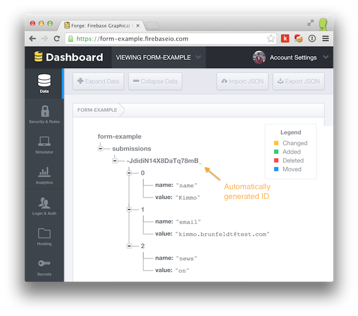

# Using Firebase as simple backend

Firebase is convenient backend solution for custom sign up pages or any page which needs to work with simple data. Of course the simplest way to manage forms would be Google Forms or other ready-made solution but sometimes you want to have a completely custom page.

We'll go through an example page where we have a form which can be submitted to server.

### Form example

First you need to [create a new Firebase app](https://www.firebase.com/how-it-works.html). For this example, I created app called `https://form-example.firebaseio.com`.

Firebase security rules are defined as simple JSON. Let's create rules where users cannot read or modify any existing data except append new key-value pairs to */submissions* location:

```json
{
  "rules": {
    // Disable everything by default
    ".read": false,
    ".write": false,

    "submissions": {

      // Allow creating a new key-value pair to submissions
      // but disable reading and modifying existing data
      "$submission": {
        ".read": false,
        ".write": "!data.exists()"
      }
    }
  }
}
```

Firebase provides good [API documentation](https://www.firebase.com/docs/web/api/). Pushing data is super easy:

```javascript
var submissionsRef = new Firebase('https://form-example.firebaseio.com/submissions');

// jQuery's form.serializeArray() gives data in the following format:
var data = [
    {'name': 'name', 'value': 'Kimmo'},
    {'name': 'email', 'value': 'kimmo.brunfeldt@test.com'},
    {'name': 'news', 'value': 'on'}
];

submissionsRef.push(data, function(err) {
    if (err) {
        window.alert('Error when submitting data: ' + err.message);
    }
});
```

This will create a new submission with automatically generated id:



As you can see, the data is not ideally formatted but it is how jQuery serializes form data by default. Here's the full HTML + JS example of a form page with Firebase as a backend:

```html
<!doctype html>
<html lang="en">
    <head>
        <meta charset="utf-8">
        <meta http-equiv="X-UA-Compatible" content="IE=edge,chrome=1">
        <title>Form</title>
        <meta name="viewport" content="width=device-width,initial-scale=1">
    </head>

    <body>
        <form id="form">
            <label for="form__name">Name</label>
            <input type="text" id="form__name" name="name">
            <br>

            <label for="form__email">Email</label>
            <input type="email" id="form__email" name="email">
            <br>

            <label for="form__participate">I want to receive news</label>
            <input type="checkbox" id="form__participate" name="news">
            <br>

            <input type="submit" value="Send">
        </form>

        <script src="https://cdn.firebase.com/js/client/2.0.6/firebase.js"></script>
        <script src="https://code.jquery.com/jquery-1.11.2.js"></script>

        <script>
        var submissionsRef = new Firebase('https://form-example.firebaseio.com/submissions');

        var $form = $('#form');
        $form.submit(function(event) {
            event.preventDefault();

            // Firebase generates random id when pushed
            var data = $form.serializeArray();
            submissionsRef.push(data, function(err) {
                if (err) {
                    window.alert('Error when submitting data: ' + err.message);
                }
            });

            window.alert('Submitted answers: \n' + JSON.stringify(data, null, 2));
            $form[0].reset();
        });
        </script>
    </body>
</html>
```

