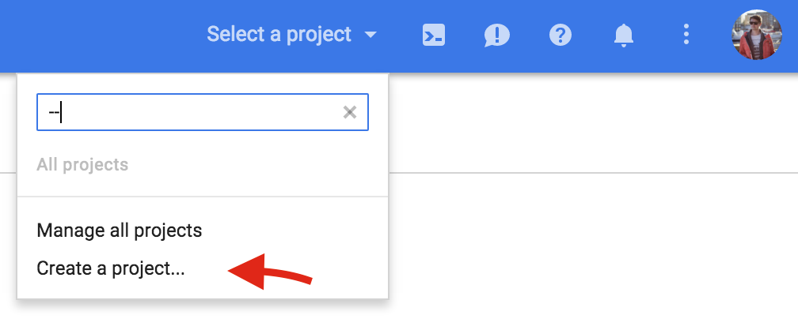
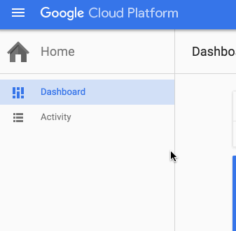
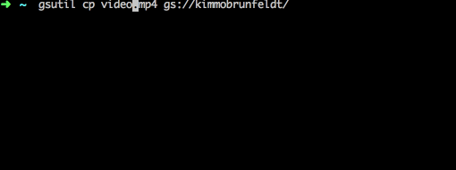

<!-- START doctoc generated TOC please keep comment here to allow auto update -->
<!-- DON'T EDIT THIS SECTION, INSTEAD RE-RUN doctoc TO UPDATE -->

- [How to get started](#how-to-get-started)
  - [1. Create Google Cloud project](#1-create-google-cloud-project)
  - [2. Create new bucket](#2-create-new-bucket)
  - [3. Install gsutil](#3-install-gsutil)
  - [4. Upload and share](#4-upload-and-share)
    - [Pre-signed URLs](#pre-signed-urls)
- [Quick reference](#quick-reference)

<!-- END doctoc generated TOC please keep comment here to allow auto update -->

[Google Cloud Storage](https://cloud.google.com/storage/) is great for personal
file sharing. Google also provides a feature to transfer all data from an S3 bucket
to Google's cloud storage bucket.

After everything is setup, the actual upload to Cloud Storage is a single command:

```bash
gsutil cp my-file.mp4 gs://<bucket-name>

# Will be accessible in this URL:
# http://<bucket-name>.storage.googleapis.com/my-file.mp4
```

## How to get started

*You need to have a Google account*

### 1. Create Google Cloud project

Sign in to [Google Cloud Console](https://console.cloud.google.com).
Create a billing account in https://console.cloud.google.com/billing.
Create a new project




### 2. Create new bucket

After creating the project, go to Storage console



Create new bucket, I named my personal bucket as "kimmobrunfeldt"
The bucket URL will be in this format: http://<bucket-name>.storage.googleapis.com/my-file.mp4

*Note: this could also be done via gsutil CLI tool*

### 3. Install gsutil

Install `gsutil` https://cloud.google.com/storage/docs/gsutil_install.
This is the Google Cloud Storage CLI tool.

Authenticate `gsutil` https://cloud.google.com/storage/docs/gsutil_install#authenticate.
You might want to check Google Cloud IAM users: https://cloud.google.com/storage/docs/iam
but currently the feature is in Alpha.

### 4. Upload and share

You can make new objects to have public-read ACL by default if that's what you want:
`gsutil defacl set public-read gs://<bucket-name>`. After that all your uploads
will be publicly readable.

Uploading is simple: `gsutil cp my-file.mp4 gs://<bucket-name>/`



#### Pre-signed URLs

It's also possible to generate signed URLs which are available limited time to minimize the
risk of accidentally creating a huge bill. The downside to this is that you always
have to generate the signed url after uploading.

To sign urls with `gsutil`, you need to setup Service Account Authentication. Follow this
guide: https://cloud.google.com/storage/docs/access-control#signing-gsutil

After that you can generate a signed url which is e.g. available for 10 minutes:

```bash
gsutil signurl -d 10m path/to/your/key.json gs://<bucket-name>/file.mp4
```

## Quick reference

Command                                                    | Description
---------------------------------------------------------- | -------------------------------
`gsutil cp file.mp4 gs://<bucket-name>/`                   | Upload file to bucket root
`gsutil rm gs://<bucket-name>/file.mp4`                    | Remove file in bucket
`gsutil acl set public-read gs://<bucket-name>/file.mp4`  | Set object ACL to public-read
`gsutil defacl set public-read gs://<bucket-name>`        | Set default ACL for new objects
`gsutil acl set private gs://<bucket-name>`                | Set bucket ACL as private
